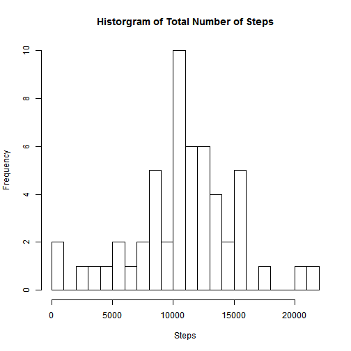
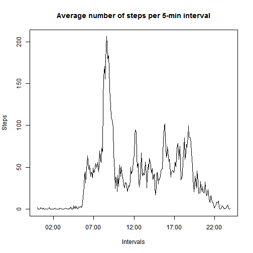
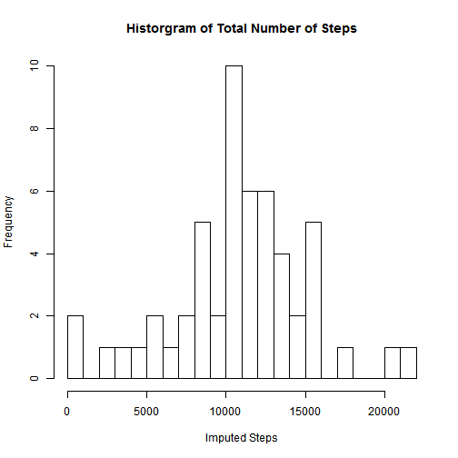
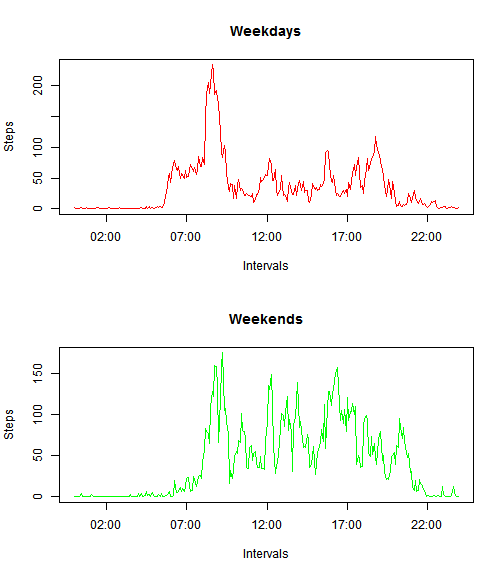

# Reproducible Research: Peer Assessment 1

## Loading and preprocessing the data

Unzip and load the data:


```r
unzip("activity.zip")
dataset = read.csv("activity.csv", header = TRUE)
summary(dataset)
```

```
##      steps               date          interval   
##  Min.   :  0.0   2012-10-01:  288   Min.   :   0  
##  1st Qu.:  0.0   2012-10-02:  288   1st Qu.: 589  
##  Median :  0.0   2012-10-03:  288   Median :1178  
##  Mean   : 37.4   2012-10-04:  288   Mean   :1178  
##  3rd Qu.: 12.0   2012-10-05:  288   3rd Qu.:1766  
##  Max.   :806.0   2012-10-06:  288   Max.   :2355  
##  NA's   :2304    (Other)   :15840
```

## What is mean total number of steps taken per day?

Histogram of the total number of steps taken each day:


```r
steps = tapply(dataset$steps, dataset$date, sum)
hist(steps, breaks = 20, main = "Historgram of Total Number of Steps", xlab = "Steps")
```

 

The mean and median total number of steps taken per day:


```r
mean(steps, na.rm = TRUE)
```

```
## [1] 10766
```

```r
median(steps, na.rm = TRUE)
```

```
## [1] 10765
```

## What is the average daily activity pattern?

Time series plot of the 5-minute interval (x-axis) and the average number of steps taken, averaged across all days (y-axis):


```r
# Calculate average steps per time interval
averagedSteps = tapply(dataset$steps, dataset$interval, mean, na.rm = TRUE)
# Create intervals columns as dates
intervals = strptime(formatC(as.numeric(names(averagedSteps)), width = 4, flag = "0"), "%H%M")
# Create dataframe and plot it
totals = data.frame(interval = intervals, steps = averagedSteps)
plot(totals, type = "l", main = "Average number of steps per 5-min interval", 
    xlab = "Intervals", ylab = "Steps")
```

 

Which 5-minute interval, on average across all the days in the dataset, contains the maximum number of steps?


```r
format(totals[which.max(totals$steps), "interval"], "%H:%M")
```

```
## [1] "08:35"
```

## Imputing missing values

Report the total number of missing values in the dataset (i.e. the total number of rows with NAs):


```r
sum(is.na(dataset))
```

```
## [1] 2304
```

Create a new dataset that is equal to the original dataset but with the missing data filled in using the mean for the missing 5-minute interval among all days:


```r
# Use plyr for useful split-apply-combine function
library(plyr)
```


```r
# Function that substitues NA values with the mean of non-NA values
impute.mean <- function(x) replace(x, is.na(x), mean(x, na.rm = TRUE))
# Create new dataset with values imputed (grouped by interval)
imputed = ddply(dataset, ~ interval, transform, steps = impute.mean(steps))
```

Histogram of the total number of steps taken each day: 


```r
imputedSteps = tapply(dataset$steps, dataset$date, sum)
hist(imputedSteps, breaks = 20, main = "Historgram of Total Number of Steps", xlab = "Imputed Steps")
```

 

The mean and median total number of steps taken per day:


```r
mean(imputedSteps, na.rm = TRUE)
```

```
## [1] 10766
```

```r
median(imputedSteps, na.rm = TRUE)
```

```
## [1] 10765
```

Do these values differ from the estimates from the first part of the assignment? What is the impact of imputing missing data on the estimates of the total daily number of steps?

```
Imputing missing values with mean value should not affect calculated mean.  
Median can be affected if the mean and median differ much (this is not our case.)
```

## Are there differences in activity patterns between weekdays and weekends?

Factor variable in the dataset with two levels -- "weekday" and "weekend" indicating whether a given date is a weekday or weekend day:


```r
# Use English locale
Sys.setlocale("LC_TIME", "English")
isWeekend = weekdays(as.Date(dataset$date)) %in% c("Saturday", "Sunday")
dataset$daytype = factor(isWeekend, levels = c(FALSE, TRUE), labels = c("weekday", "weekend"))
```

Panel plot containing a time series plot of the 5-minute interval (x-axis) and the average number of steps taken, averaged across all weekday days or weekend days (y-axis):


```r
par(mfrow = c(2, 1))
# Weekdays
weekdays = dataset[dataset$daytype == "weekday", ]
aveWeekdays = data.frame(interval = intervals, 
    steps = tapply(weekdays$steps, weekdays$interval, mean, na.rm = TRUE))
plot(aveWeekdays, type = "l", main = "Weekdays", xlab = "Intervals", ylab = "Steps", col = "red")

# Weekends 
weekends = dataset[dataset$daytype == "weekend", ]
aveWeekends = data.frame(interval = intervals, 
    steps = tapply(weekends$steps, weekends$interval, mean, na.rm = TRUE))
plot(aveWeekends, type = "l", main = "Weekends", xlab = "Intervals", ylab = "Steps", col = "green")
```

 
